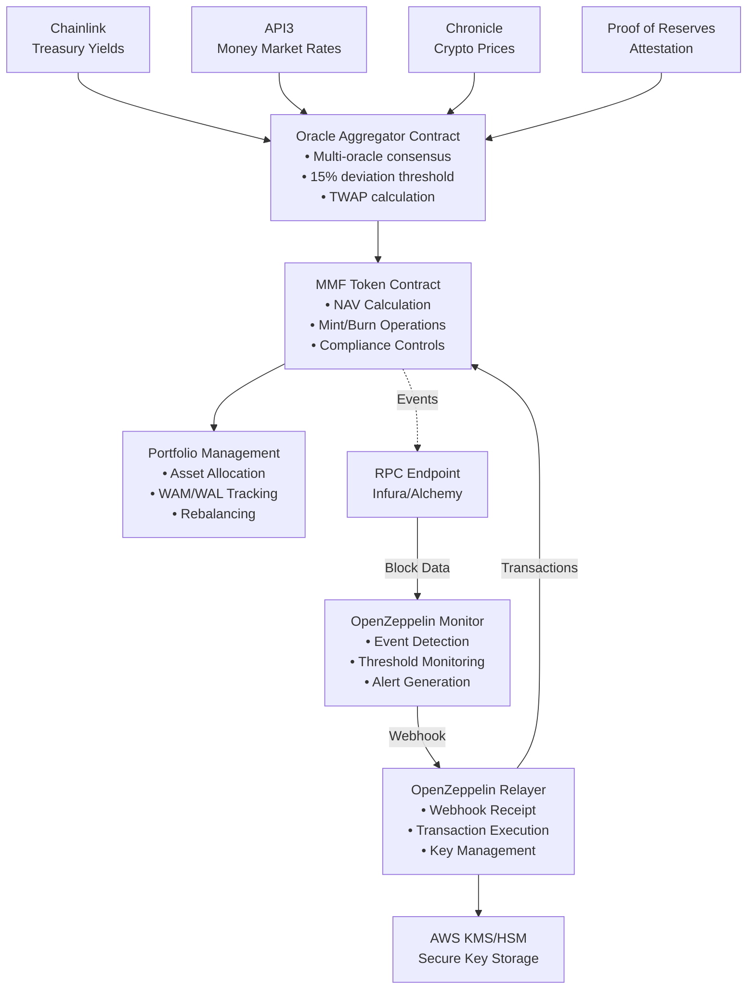
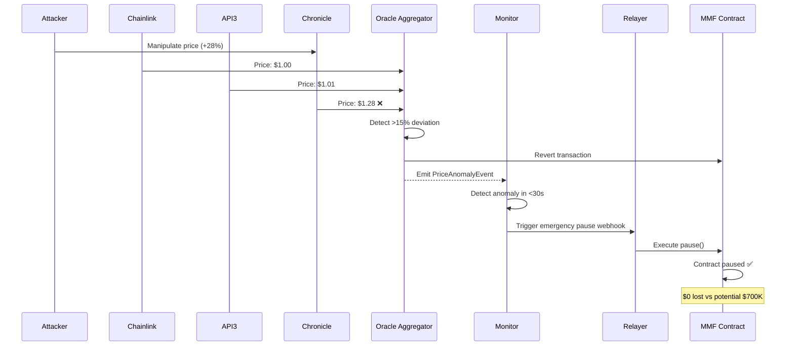
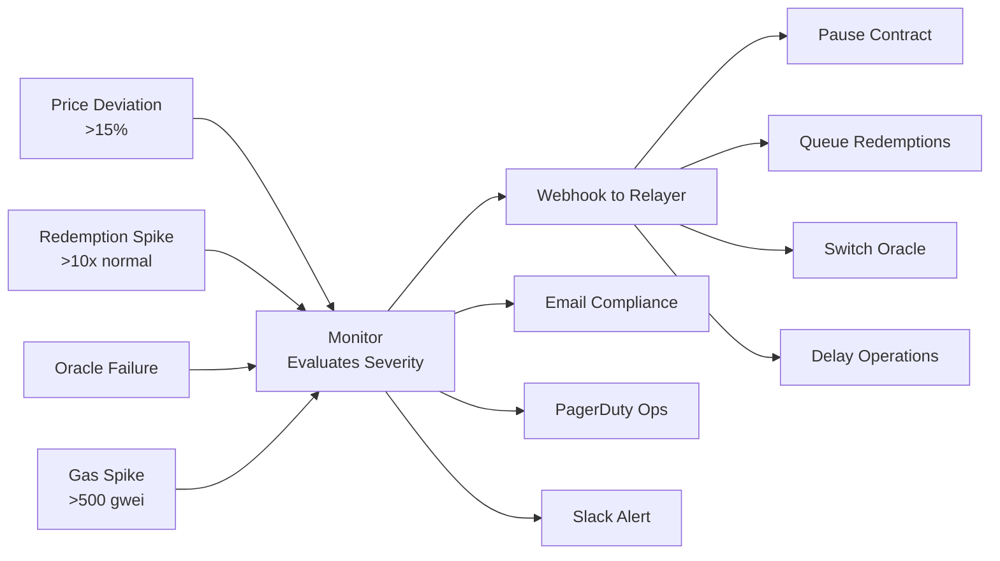

# MMF Architecture Diagrams (Mermaid Format)

## Complete System Architecture

```mermaid
graph TB
    CL[Chainlink<br/>Treasury Yields]
    API[API3<br/>Money Market Rates]
    CHR[Chronicle<br/>Crypto Prices]
    POR[Proof of Reserves<br/>Attestation]
    
    OA[Oracle Aggregator Contract<br/>• Multi-oracle consensus<br/>• 15% deviation threshold<br/>• TWAP calculation]
    
    MMF[MMF Token Contract<br/>• NAV Calculation<br/>• Mint/Burn Operations<br/>• Compliance Controls]
    PM[Portfolio Management<br/>• Asset Allocation<br/>• WAM/WAL Tracking<br/>• Rebalancing]
    
    RPC[RPC Endpoint<br/>Infura/Alchemy]
    MON[OpenZeppelin Monitor<br/>• Event Detection<br/>• Threshold Monitoring<br/>• Alert Generation]
    
    REL[OpenZeppelin Relayer<br/>• Webhook Receipt<br/>• Transaction Execution<br/>• Key Management]
    KMS[AWS KMS/HSM<br/>Secure Key Storage]
    
    CL --> OA
    API --> OA
    CHR --> OA
    POR --> OA
    
    OA --> MMF
    MMF --> PM
    
    MMF -.->|Events| RPC
    RPC -->|Block Data| MON
    MON -->|Webhook| REL
    REL -->|Transactions| MMF
    REL --> KMS
    
```

## Oracle Manipulation Prevention Flow

```mermaid
sequenceDiagram
    participant Attacker
    participant Oracle1 as Chainlink
    participant Oracle2 as API3
    participant Oracle3 as Chronicle
    participant OA as Oracle Aggregator
    participant MON as Monitor
    participant REL as Relayer
    participant MMF as MMF Contract
    
    Attacker->>Oracle3: Manipulate price (+28%)
    Oracle1->>OA: Price: $1.00
    Oracle2->>OA: Price: $1.01
    Oracle3->>OA: Price: $1.28 ❌
    
    OA->>OA: Detect >15% deviation
    OA->>MMF: Revert transaction
    OA-->>MON: Emit PriceAnomalyEvent
    
    MON->>MON: Detect anomaly in <30s
    MON->>REL: Trigger emergency pause webhook
    REL->>MMF: Execute pause()
    MMF->>MMF: Contract paused ✅
    
    Note over MMF: $0 lost vs potential $700K
```

## Incident Response Architecture

```mermaid
flowchart LR
    M1[Price Deviation<br/>>15%]
    M2[Redemption Spike<br/>>10x normal]
    M3[Oracle Failure]
    M4[Gas Spike<br/>>500 gwei]
    
    MON[Monitor<br/>Evaluates Severity]
    
    R1[Pause Contract]
    R2[Queue Redemptions]
    R3[Switch Oracle]
    R4[Delay Operations]
    
    N1[Webhook to Relayer]
    N2[Email Compliance]
    N3[PagerDuty Ops]
    N4[Slack Alert]
    
    M1 --> MON
    M2 --> MON
    M3 --> MON
    M4 --> MON
    
    MON --> N1
    MON --> N2
    MON --> N3
    MON --> N4
    
    N1 --> R1
    N1 --> R2
    N1 --> R3
    N1 --> R4
```